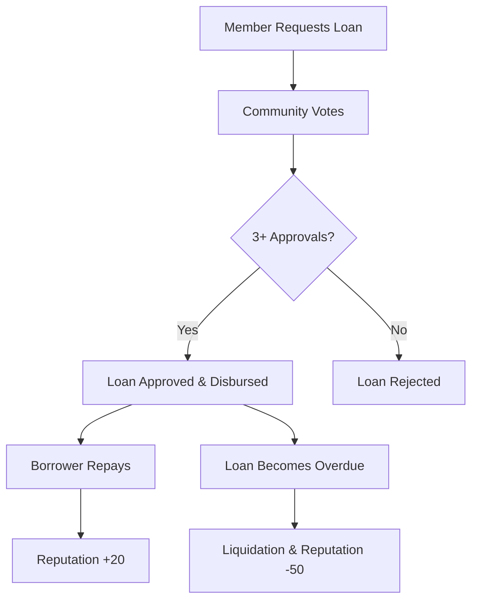

# 🚨 Emergency Lending DAO (EmergiDAO)

> 💰 **Token-based mutual aid microloans for community emergency support**

## 🌟 Overview

EmergiDAO is a decentralized autonomous organization that provides emergency microloans to community members through a reputation-based mutual aid system. Members contribute to a shared pool and can request emergency loans based on their reputation score and community approval.

## ✨ Key Features

- 🤝 **Community-Driven**: Members vote on loan approvals
- 📊 **Reputation System**: Build trust through contributions and timely repayments  
- ⚡ **Quick Access**: Emergency loans for urgent financial needs
- 🔒 **Decentralized**: No central authority, community-governed
- 💎 **Low Interest**: Minimal 5% interest rate for sustainability

## 🚀 How It Works

### 1. 👥 Join the DAO
```clarity
(contract-call? .Emergency-Lending join-dao)
```
- Start with 100 reputation points
- Become part of the mutual aid community

### 2. 💰 Contribute to Pool
```clarity
(contract-call? .Emergency-Lending contribute-to-pool u1000)
```
- Add STX to the shared lending pool
- Earn +10 reputation points per contribution
- Track your total contributions

### 3. 📝 Request Emergency Loan
```clarity
(contract-call? .Emergency-Lending request-loan u500)
```
- Request up to 10,000 STX
- Requires minimum 50 reputation points
- Maximum 3 active loans per member

### 4. 🗳️ Community Voting
```clarity
(contract-call? .Emergency-Lending vote-on-loan u1 true)
```
- Members with 75+ reputation can vote
- Each member votes once per loan
- Approval requires 3+ positive votes

### 5. ✅ Loan Approval & Disbursement
```clarity
(contract-call? .Emergency-Lending approve-loan u1)
```
- Automatically transfers STX to borrower
- Updates pool balance and member records

### 6. 💸 Repay Loan
```clarity
(contract-call? .Emergency-Lending repay-loan u1)
```
- Repay principal + 5% interest
- Earn reputation bonus for timely payment
- Penalty for late payment

## 📋 Requirements & Limits

| Parameter | Value |
|-----------|-------|
| 🎯 **Min Reputation for Loans** | 50 points |
| 🗳️ **Min Reputation for Voting** | 75 points |
| ✅ **Votes Required for Approval** | 3 votes |
| 💰 **Max Loan Amount** | 10,000 STX |
| ⏰ **Loan Duration** | 1,440 blocks (~10 days) |
| 💸 **Interest Rate** | 5% |
| 📊 **Max Active Loans** | 3 per member |

## 🎯 Reputation System

| Action | Reputation Change |
|--------|------------------|
| 💰 Contribute to pool | +10 points |
| ✅ Repay on time | +20 points |
| ⏰ Late repayment | -10 points |
| 🚫 Default/liquidation | -50 points |

## 📖 Contract Functions

### 🔓 Public Functions

#### Member Management
- `join-dao()` - Join the DAO community
- `contribute-to-pool(amount)` - Add STX to lending pool
- `withdraw-contribution(amount)` - Withdraw your contributions

#### Loan Operations
- `request-loan(amount)` - Request emergency loan
- `vote-on-loan(loan-id, approve)` - Vote on loan requests
- `approve-loan(loan-id)` - Execute approved loans
- `repay-loan(loan-id)` - Repay borrowed amount + interest

#### Risk Management
- `liquidate-overdue-loan(loan-id)` - Handle overdue loans

### 📖 Read-Only Functions

- `get-member-info(member)` - View member reputation & stats
- `get-loan-info(loan-id)` - View loan details
- `get-pool-balance()` - Check total pool balance
- `get-member-contribution(member)` - View member's contributions
- `get-loan-approval-count(loan-id)` - Check vote count
- `has-voted(loan-id, voter)` - Check if member voted
- `get-contract-info()` - View contract parameters

## 🔧 Usage Examples

### Check Your Member Status
```clarity
(contract-call? .Emergency-Lending get-member-info 'SP1ABC...)
```

### View Pool Balance
```clarity
(contract-call? .Emergency-Lending get-pool-balance)
```

### Check Loan Details
```clarity
(contract-call? .Emergency-Lending get-loan-info u1)
```

## ⚠️ Error Codes

| Code | Error | Description |
|------|-------|-------------|
| u100 | ERR_NOT_AUTHORIZED | Insufficient permissions |
| u101 | ERR_INSUFFICIENT_BALANCE | Not enough funds |
| u102 | ERR_LOAN_NOT_FOUND | Invalid loan ID |
| u103 | ERR_LOAN_ALREADY_REPAID | Loan already settled |
| u104 | ERR_LOAN_NOT_DUE | Loan not yet overdue |
| u105 | ERR_INVALID_AMOUNT | Invalid amount specified |
| u106 | ERR_MEMBER_NOT_FOUND | Member not in DAO |
| u107 | ERR_ALREADY_MEMBER | Already joined DAO |
| u108 | ERR_INSUFFICIENT_REPUTATION | Need higher reputation |
| u109 | ERR_LOAN_OVERDUE | Loan past due date |

## 🛡️ Security Features

- ✅ **Reputation-based access control**
- ✅ **Multi-signature loan approval**
- ✅ **Automatic liquidation of overdue loans**
- ✅ **Contribution tracking and withdrawal limits**
- ✅ **Interest-based sustainability model**

## 🚀 Getting Started

1. **Deploy** the contract to Stacks blockchain
2. **Join** the DAO using `join-dao()`
3. **Contribute** STX to build reputation
4. **Participate** in community voting
5. **Request** emergency loans when needed

## 🤝 Community Guidelines

- 💪 **Build reputation** through consistent contributions
- 🗳️ **Vote responsibly** on loan requests
- ⏰ **Repay on time** to maintain community trust
- 🤲 **Support others** in emergency situations

## 🛠️ Development

### Prerequisites
- Clarinet CLI
- Node.js & npm
- Stacks wallet

### Local Development
```bash
# Clone the repository
git clone https://github.com/Hipper234/Emergency-Lending-DAO.git
cd Emergency-Lending-DAO

# Check contract syntax
clarinet check

# Run tests
clarinet test

# Deploy locally
clarinet console
```

### Testing
```bash
# Run all tests
clarinet test

# Run specific test file
clarinet test tests/emergency-lending_test.ts
```

## 📊 Contract Architecture

```
Emergency-Lending.clar
├── Constants & Error Codes
├── Data Variables (pool balance, loan settings)
├── Data Maps (members, loans, votes)
├── Public Functions (join, contribute, loan operations)
├── Private Functions (reputation updates)
└── Read-Only Functions (getters)
```

## 🔄 Loan Lifecycle



## 📈 Roadmap

- [ ] 🎨 **Frontend Interface** - Web app for easy interaction
- [ ] 📱 **Mobile App** - Native mobile experience
- [ ] 🔔 **Notification System** - Loan reminders and updates
- [ ] 📊 **Analytics Dashboard** - Pool and member statistics
- [ ] 🌐 **Multi-chain Support** - Expand to other blockchains
- [ ] 🤖 **Automated Risk Assessment** - AI-powered loan evaluation

## 🤝 Contributing

We welcome contributions! Please see our [Contributing Guidelines](CONTRIBUTING.md) for details.

1. Fork the repository
2. Create your feature branch (`git checkout -b feature/amazing-feature`)
3. Commit your changes (`git commit -m 'Add amazing feature'`)
4. Push to the branch (`git push origin feature/amazing-feature`)
5. Open a Pull Request

## 📄 License

This project is licensed under the MIT License - see the [LICENSE](LICENSE) file for details.

## 🙏 Acknowledgments

- Built on the Stacks blockchain
- Inspired by traditional rotating credit associations
- Community-driven development

## 📞 Support

For questions and support, please open an issue on GitHub or contact the development team.

